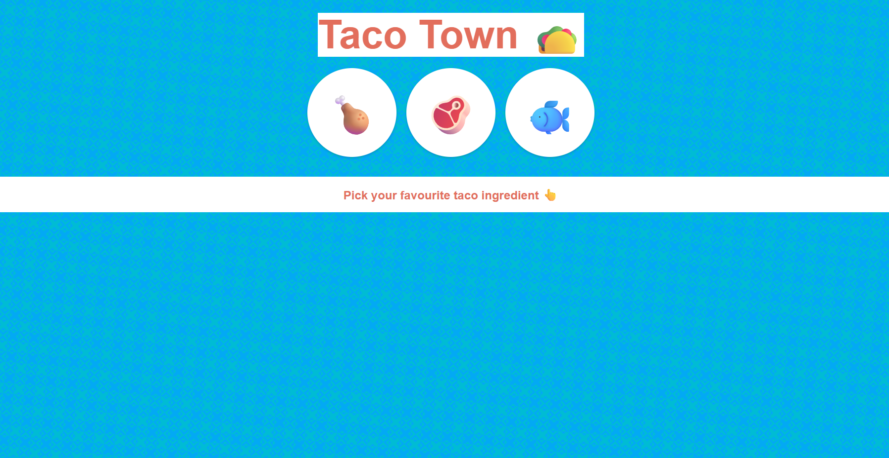
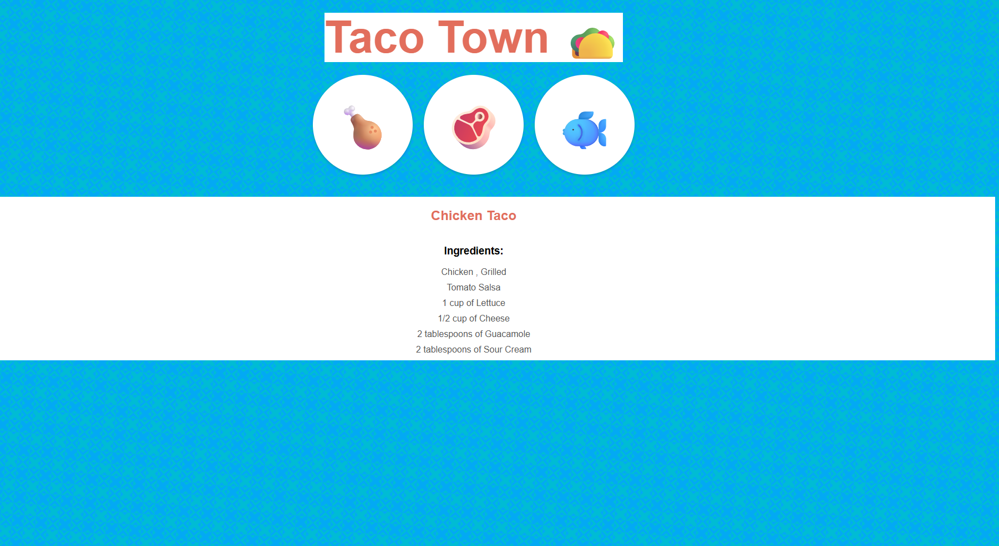

# 🌮 Recipe Page using JSON  

A simple website showcasing taco recipes dynamically using JSON data.  
Built with **EJS**, **CSS**, and **Node.js + Express**.  

---
| 🌮 Recipe Page |
|----------------|
|  |
|  |
---
## ✨ Features
- Select between **Chicken, Beef, or Fish** tacos  
- Recipes rendered dynamically using **EJS**  
- JSON-based recipe data for easy updates  
- Clean modular structure with `views` and `public` folders  
- Easy setup with **npm**  

---

## 📂 Project Structure
.<br>
├── views/<br>
│ └── index.ejs<br>
├── public/<br>
│ └── styles/<br>
│ └── main.css<br>
├── recipe.json<br>
├── index.js<br>
├── package.json<br>
└── README.md<br>


---

## 🚀 Installation & Setup  

1. **Clone the repository**  
```bash
git clone https://github.com/<your-username>/Recipe_page_using_JSON.git
cd Recipe_page_using_JSON
```

2. **Install dependencies**
```bash
npm install
```

3. **Start the server**
```bash
node index.js
```

# Open in browser<br><br>
[https://localhost:3000](https://localhost:3000)


---


